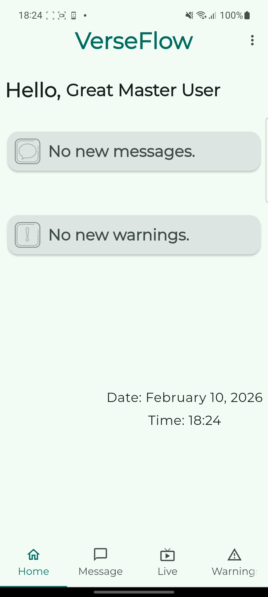
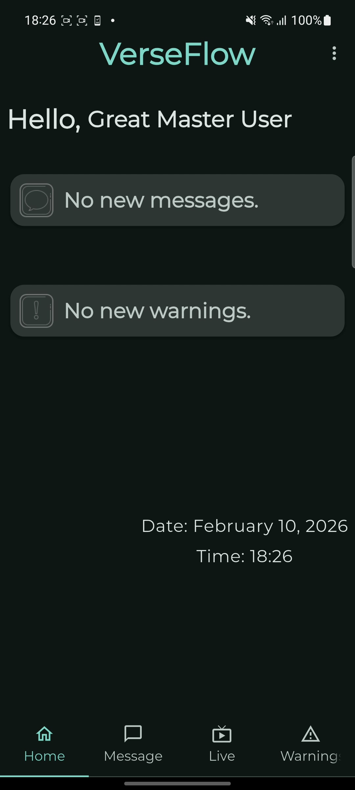
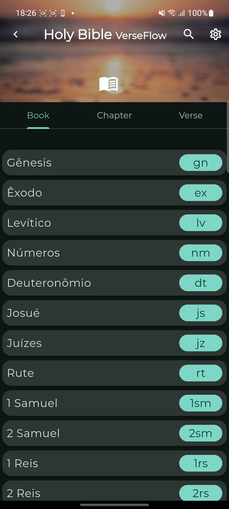
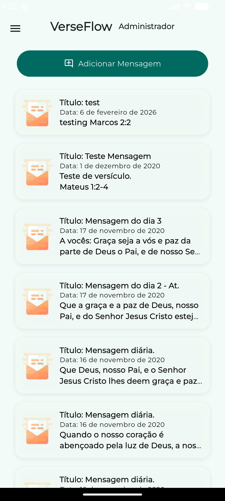
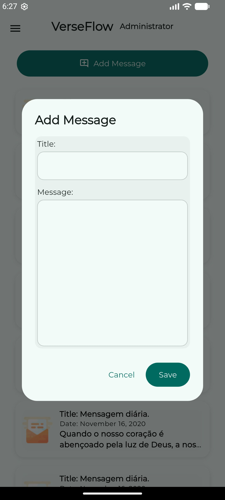
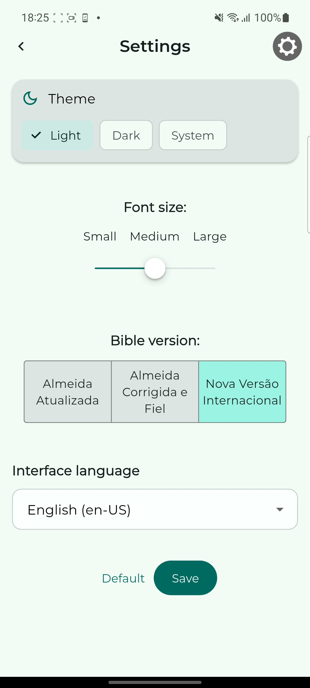

# VerseFlow

**⚠️ IMPORTANT NOTICE – ALL RIGHTS RESERVED ⚠️**

This project is a **personal portfolio demonstration only**.  

**No usage, modification, distribution, commercial use, or incorporation into other projects is permitted without explicit written permission from the author.**

The code, assets, designs, screenshots, and any other materials are shared exclusively for recruiters, hiring managers, and technical evaluators to review my skills in Flutter, Firebase, Material 3, internationalization, and app architecture.

Cloning, forking, or downloading does NOT grant any rights to use, adapt, or republish this work.

See the [LICENSE](./LICENSE) file for full details.

For licensing inquiries, collaboration requests, or permission to use any part of this project, please open an issue in this repository.

## Screenshots

### User Area

| Home (Light Mode)                      | Home (Dark Mode)                                | Bible Module                     |
|----------------------------------------|-------------------------------------------------|----------------------------------|
|  |  |  |

### Admin Area

| Admin Messages                                          | Add/Edit Message                    | Settings                         |
|---------------------------------------------------------|-------------------------------------|----------------------------------|
|  |  |  |

*(More screenshots available in the `screenshots/` folder)*

## Demo Video

Watch a quick demo of the app in action:

<video src="videos/verseflow-demo.mp4" controls width="100%" max-width="800px" style="border-radius: 8px; box-shadow: 0 4px 12px rgba(0,0,0,0.2);">
  Your browser does not support the video tag.
</video>

## Features

- Daily inspirational Bible messages with title, date, content, and reference verse
- Admin panel to create, edit, delete messages, warnings, and manage user registrations
- Advanced Bible verse search across AA, ACF, and NVI versions (offline SQLite)
- User registration with admin approval workflow
- Interface in Portuguese (pt-BR) and English (en-US) with manual language selector
- Light & Dark mode (automatic system or manual toggle)
- Customizable font size for comfortable Bible reading
- Responsive design (adapts well to phones and tablets)
- Firebase integration (Authentication + Firestore for real-time data)

## Tech Stack

- Flutter 3.24+
- Material 3 (modern design system with dynamic colors)
- Firebase (Auth + Firestore)
- intl (internationalization – pt-BR & en-US)
- shared_preferences (local settings: language, font size, Bible version)
- sqflite (offline Bible search)
- flutter_launcher_icons (custom app icon)
- fluttertoast (custom toasts)
- Google Fonts (modern typography)

## Current Status & Known Limitations

- The app is fully functional on Android with Material 3, dark mode, internationalization (pt-BR/en-US), offline Bible search, admin approval workflow, and real-time Firebase sync.
- A few UI texts, dialogs, and messages are still missing full English translations (ongoing work).
- iOS support is not yet implemented/tested.
- Additional features planned: push notifications for new messages, live stream integration improvements, and more Bible versions.

## How to Run

1. Clone the repository
   git clone https://github.com/rliuw/verseflow.git
   cd verseflow

2. Install dependencies
   flutter pub get

3. Configure Firebase
   Add google-services.json (Android) to android/app/ folder. 
   Enable Authentication (Email/Password) and Firestore in Firebase Console.

   Note: iOS support is not yet implemented/tested. The app currently runs only on Android.

4. Run the app
   flutter run

## Folder Structure

lib/
├── main.dart                  # Entry point + theme setup (Material 3, dark mode)
├── l10n/                      # Internationalization (.arb files for pt-BR & en-US)
├── screens/                   # All screens (login, home, bible, admin, settings)
├── tiles/                     # Reusable card widgets (message_card, warning_card, etc.)
├── helpers/                   # Utilities (shared prefs, bible helpers, book codes)
├── models/                    # Data models (user, message, etc.)
assets/                        # Images, icons, fonts
screenshots/                   # Portfolio screenshots
android/                       # Android-specific (manifest, gradle)
ios/                           # iOS-specific (Info.plist) - to be implemented

## License
All Rights Reserved – see LICENSE for details.
This project is not open-source and may not be used, modified, distributed, or incorporated into any other work without explicit written permission from the author.

## Contact / Portfolio

GitHub: @RLiuW

Feel free to star rate ⭐ the repo if you like the project, always remembering the usage restrictions.
Questions or feedback? Open an issue!